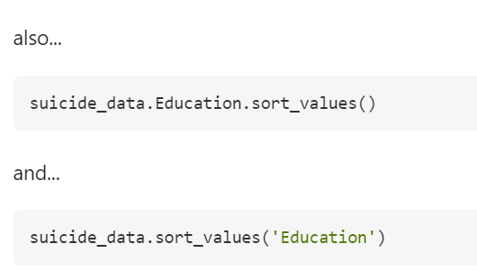
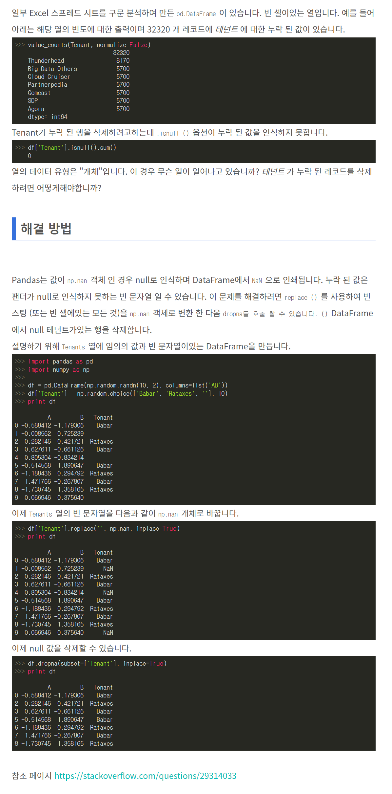

# idmax()

 [`DataFrame.idxmax()`](https://pandas.pydata.org/pandas-docs/stable/reference/api/pandas.DataFrame.idxmax.html) 함수는 행에서 최대 값의 색인을 반환

# sort_values()



```py
suicide_data.sort_values(by='Education')
```

```
data_gu = data_gu.sort_values(by="비중",ascending = False,ignore_index= True)
```

# 빈칸삭제



참조 페이지 https://stackoverflow.com/questions/29314033

 https://codesample-factory.tistory.com/1081


# 합치기

## 1. merge()

 pd.merge()함수에서는 첫 번째 인수 left와 두 번째 인수 right를 결합하는 두 개의 pandas.DataFrame을 지정한다.

```
print(pd.merge(df_ab, df_ac))
#      a    b    c
# 0  a_1  b_1  c_1
# 1  a_2  b_2  c_2
```

 merger()메소드의 경우는 left에 해당하는 pandas.DataFrame에서 부터 메소드를 호출하고, right에 해당하는 pandas.DataFrame를 인수로써 지정한다.

```
print(df_ab.merge(df_ac))
#      a    b    c
# 0  a_1  b_1  c_1
# 1  a_2  b_2  c_2
```

 어느쪽의 방법이든 결합된 pandas.DataFrame가 반환된다.

 아래에서 설명하는 인수는 pd.merge()메소드에서도 merge()메소드에도 동일하다.

 

 

## **키가 되는 열을 지정: 인수on, left_on, right_on**

------

 기본적으로 2개의 pandas.DataFrame에 공통되는 열 이름을 키로 하여 결합 처리가 이루어진다.

 명시적으로 지정하는 경우에는 인수 on을 사용한다. 생략해도 문제가 없지만, 명시해두는 것이 나중에 다시 봤을 때에도 알기 쉬울 것이다.

```
print(pd.merge(df_ab, df_ac, on='a'))
#      a    b    c
# 0  a_1  b_1  c_1
# 1  a_2  b_2  c_2
```

 인수 left_on, right_on으로 각각의 pandas.DataFrame의 열 이름을 각각 지정하는 것도 가능하다.

```
df_ac_ = df_ac.rename(columns={'a': 'a_'})
print(df_ac_)
#     a_    c
# 0  a_1  c_1
# 1  a_2  c_2
# 2  a_4  c_4

print(pd.merge(df_ab, df_ac_, left_on='a', right_on='a_'))
#      a    b   a_    c
# 0  a_1  b_1  a_1  c_1
# 1  a_2  b_2  a_2  c_2
```

 이 경우, 두 개의 열이 남으므로, 필요하지 않는 열에 대해서는 drop()메소드를 이용해서 삭제해줘야한다. 사용법은 다음과 같다.

```
print(pd.merge(df_ab, df_ac_, left_on='a', right_on='a_').drop(columns='a_'))
#      a    b    c
# 0  a_1  b_1  c_1
# 1  a_2  b_2  c_2
```

 on, left_on, right_on에 열 이름의 리스트를 짖어하여 여러 개의 열을 키로써 지정하는 것이 가능하다. 그에 대한 내용은 뒤에서 설명하도록 하겠다.

 

 

## **결합 방법을 지정: 인수how**

------

 결합방법은 인수 how의 문자열로 지정한다. 기본적으로는 how='inner'이다. 데이터가 없는 요소는 결손값 Nan이 된다. 

### **inner_join : how='inner'**

```
print(pd.merge(df_ab, df_ac, on='a', how='inner'))
#      a    b    c
# 0  a_1  b_1  c_1
# 1  a_2  b_2  c_2
```

### **left_join : how='left'**

```
print(pd.merge(df_ab, df_ac, on='a', how='left'))
#      a    b    c
# 0  a_1  b_1  c_1
# 1  a_2  b_2  c_2
# 2  a_3  b_3  NaN
```

### **right_join : how='right'**

```
print(pd.merge(df_ab, df_ac, on='a', how='right'))
#      a    b    c
# 0  a_1  b_1  c_1
# 1  a_2  b_2  c_2
# 2  a_4  NaN  c_4
```

### **outer_join : how='outer'**

```
print(pd.merge(df_ab, df_ac, on='a', how='outer'))
#      a    b    c
# 0  a_1  b_1  c_1
# 1  a_2  b_2  c_2
# 2  a_3  b_3  NaN
# 3  a_4  NaN  c_4
```

 

 

## **데이터의 정보를 취득 : 인수indicator**

------

인수 indicator를 True로 하면, 원래 데이터의 정보를 포함한 열이 추가된다.

기본적으로 _merge이라는 행이 추가되어, both, left_only, right_only중 하나로 분류된다.

```
print(pd.merge(df_ab, df_ac, on='a', how='inner', indicator=True))
#      a    b    c _merge
# 0  a_1  b_1  c_1   both
# 1  a_2  b_2  c_2   both

print(pd.merge(df_ab, df_ac, on='a', how='outer', indicator=True))
#      a    b    c      _merge
# 0  a_1  b_1  c_1        both
# 1  a_2  b_2  c_2        both
# 2  a_3  b_3  NaN   left_only
# 3  a_4  NaN  c_4  right_only
```

_merge가 아닌 임의의 열 명으로 하고 싶은 경우에는 인수 indicator에 문자열을 지정한다.

```
print(pd.merge(df_ab, df_ac, on='a', how='outer', indicator='indicator'))
#      a    b    c   indicator
# 0  a_1  b_1  c_1        both
# 1  a_2  b_2  c_2        both
# 2  a_3  b_3  NaN   left_only
# 3  a_4  NaN  c_4  right_only
```

 

 


출처: https://engineer-mole.tistory.com/208 [매일 꾸준히, 더 깊이]