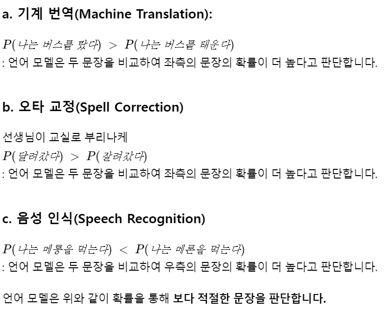
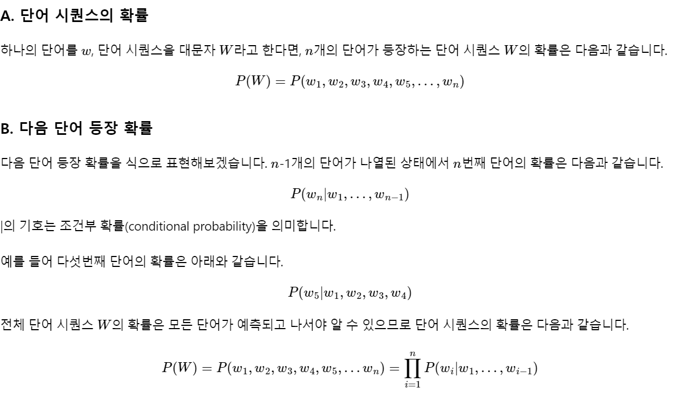
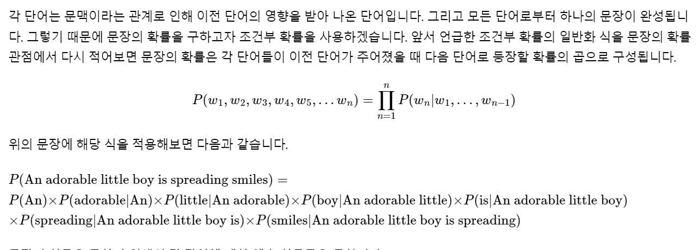
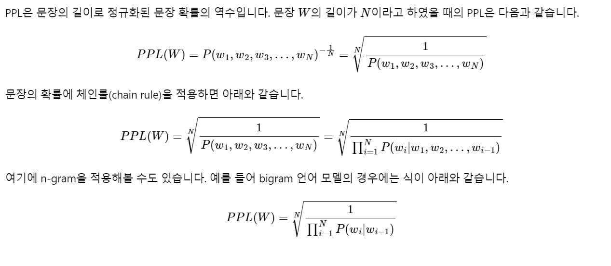
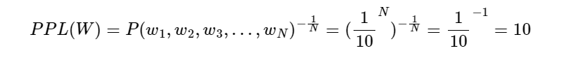

# 3. 언어 모델(Language Model)

## 1) 언어 모델(Language Model)이란?
### 1. 언어모델

언어라는 현상을 모델링하고자 단어 시퀀스(문장)에 확률을 할당(assign)하는 모델

- 통계를 이용한 방법

- 인공 신경망을 이용한 방법: GPT나 BERT 또한 인공 신경망 언어 모델의 개념을 사용

- 가장 자연스러운 단어 시퀀스를 찾아내는 모델입니다. 

- 단어 시퀀스에 확률을 할당 보편 방법: 

  - 언어 모델이 이전 단어들이 주어졌을 때 다음 단어를 **예측**

  - 다른 유형의 언어 모델로는 주어진 양쪽의 단어들로부터 가운데 비어있는 단어를 예측 : BERT 

### 2. 언어 모델링(Language Modeling)

주어진 단어들로부터 아직 모르는 단어를 예측하는 작업

언어 모델이 이전 단어들로부터 다음 단어를 예측하는 일

### 3. 단어 시퀀스의 확률 할당

### 4. 주어진 이전 단어들로부터 다음 단어 예측하기
언어 모델은 단어 시퀀스에 확률을 할당하는 모델

## 2) 통계적 언어 모델(Statistical Language Model, SLM)

### **1. 조건부 확률**

조건부 확률은 두 확률 P(A),P(B)에 대해서 아래와 같은 관계를 갖습니다.

p(B|A)=P(A,B)/P(A)

P(A,B)=P(A)P(B|A)

일반화
P(A,B,C,D)=P(A)P(B|A)P(C|A,B)P(D|A,B,C)

연쇄 법칙(chain rule)

P(x1,x2,x3...xn)=P(x1)P(x2|x1)P(x3|x1,x2)...P(xn|x1...xn−1)

조건부 확률에 대한 정의를 통해 문장의 확률을 구해보겠습니다.

### **2. 문장에 대한 확률**

 **P(An adorable little boy is spreading smiles)**

문장의 확률은 각 단어들이 이전 단어가 주어졌을 때 다음 단어로 등장할 확률의 곱

### **3. 카운트 기반의 접근**

문장의 확률: 다음 단어에 대한 예측 확률을 모두 곱한

이전 단어로부터 다음 단어에 대한 확률:카운트에 기반하여 확률을 계산

An adorable little boy가 나왔을 때, is가 나올 확률:P(is|An adorable little boy)

=count(An adorable little boy is)/count(An adorable little boy )

 예를 들어 기계가 학습한 코퍼스 데이터에서 An adorable little boy가 100번 등장했는데 그 다음에 is가 등장한 경우는 30번이라고 합시다. 이 경우 P(is|An adorable little boy)는 30%입니다.

### **4. 카운트 기반 접근의 한계 - 희소 문제(Sparsity Problem)**

언어 모델은 실생활에서 사용되는 언어의 확률 분포를 근사 모델링 

언어 모델을 통해 현실에서의 확률 분포를 근사하는 것이 언어 모델의 목표

카운트 기반으로 접근하려고 한다면 갖고있는 코퍼스(corpus). 즉, 다시 말해 기계가 훈련하는 데이터는 정말 방대한 양이 필요

코퍼스에 단어 시퀀스가 없다고 해서 이 확률을 0 또는 정의되지 않는 확률이라고 하는 것이 정확한 모델링 방법일까요? 아닙니다. 현실에선 An adorable little boy is 라는 단어 시퀀스가 존재하고 또 문법에도 적합하므로 정답일 가능성 또한 높습니다. 

#### 희소문제

충분한 데이터를 관측하지 못하여 언어를 정확히 모델링하지 못하는 문제를 **희소 문제(sparsity problem)**라고 합니다.

완화하는 방법: n-gram 언어 모델/ 스무딩,백오프( 일반화(generalization) 기법이 존재

근본적인 해결책은 아님

따라서 트렌드가 인공 신경망 언어 모델로 넘어감

## 3) N-gram 언어 모델(N-gram Language Model)

n-gram 언어 모델은 여전히 **카운트에 기반한 통계적 접근**을 사용

모든 단어를 고려하는 것이 아니라 **일부 단어만 고려**하는 접근 방법을 사용

**일부 단어를 몇 개 보느냐를 결정**하는데 이것이 n-gram에서의 n이 가지는 의미

### **1. 코퍼스에서 카운트하지 못하는 경우의 감소.**

SLM의 한계는 훈련 코퍼스에 확률을 계산하고 싶은 문장이나 단어가 없을 수 있다는 점

**확률을 계산하고 싶은 문장이 길어질수록** 갖고있는 코퍼스에서 그 문장이 **존재하지 않을 가능성이 높음**

다음과 같이 참고하는 단어들을 줄이면 카운트를 할 수 있을 가능성이 높일 수 있음

P(is|An adorable little boy)≈ P(is|boy)

지나친 일반화로 느껴진다면 

P(is|An adorable little boy)≈ P(is|little boy)

앞 단어 중 임의의 개수만 포함해서 카운트하여 근사=>코퍼스에서 해당 단어의 시퀀스를 카운트할 확률이 높아짐

### **2. N-gram**

이때 임의의 개수를 정하기 위한 기준: n-gram

n-gram은 n개의 연속적인 단어 나열을 의미

코퍼스에서 n개의 단어 뭉치 단위로 끊어서 이를 하나의 토큰으로 간주

예)An adorable little boy is spreading smiles=>

**uni**grams : an, adorable, little, boy, is, spreading, smiles
**bi**grams : an adorable, adorable little, little boy, boy is, is spreading, spreading smiles
**tri**grams : an adorable little, adorable little boy, little boy is, boy is spreading, is spreading smiles
**4**-grams : an adorable little boy, adorable little boy is, little boy is spreading, boy is spreading smiles

- n-gram을 이용한 언어 모델을 설계

n-gram을 통한 언어 모델에서는 다음에 나올 단어의 예측은 오직 n-1개의 단어에만 의존

예) **'An adorable little boy is spreading'** 다음에 나올 단어를 예측

 4-gram을 이용한 언어 모델을 사용

 spreading 다음에 올 단어를 예측하는 것은 n-1에 해당되는 앞의 **3개의 단어만을 고려**

P(w|boy is spreading)=count(boy is spreading w)/count(boy is spreading)

만약 갖고있는 코퍼스에서 boy is spreading가 1,000번 등장

그리고 boy is spreading insults가 500

boy is spreading smiles가 200번

boy is spreading 다음에 insults가 등장할 확률은 50%이며, smiles가 등장할 확률은 20%확률적 선택에 따라 우리는 insults가 더 맞다고 판단

P(insults|boy is spreading)=0.500

P(smiles|boy is spreading)=0.200

### **3. N-gram Language Model의 한계**

**작고 사랑하는 소년**이 하는 행동에 대해 다음 단어를 예측하는 언어 모델이었다면 과연 '작고 사랑스러운 소년이' **'모욕을 퍼트렸다'**라는 부정적인 내용이 **'웃음 지었다'**라는 긍정적인 내용 대신 선택되었을까요?

 n-gram은 뒤의 단어 몇 개만 보다 보니 의도하고 싶은 대로 문장을 끝맺음하지 못하는 경우가 생긴다는 점

문맥이 전혀 연결 안 되는 경우도 생길 수 있다. 

전체 문장을 고려한 언어 모델보다는 정확도가 떨어질 수밖에 없다

#### **(1) 희소 문제(Sparsity Problem)**

문장에 존재하는 앞에 나온 단어를 모두 보는 것보다 일부 단어만을 보는 것으로 현실적으로 코퍼스에서 카운트 할 수 있는 확률을 높일 수는 있었지만, n-gram 언어 모델도 여전히 n-gram에 대한 희소 문제가 존재합니다.

#### **(2) n을 선택하는 것은 trade-off 문제.**

**n을 크게 선택하**면 실제 훈련 코퍼스에서 해당 **n-gram을 카운트할 수 있는 확률은 적어지므로** 희소 문제 심각

또한 n이 커질수록 모델 사이즈가 커진다는 문제점

n을 작게 선택하면 훈련 코퍼스에서 카운트는 잘 되겠지만 근사의 정확도는 현실의 확률분포와 멀어짐

 trade-off 문제로 인해 정확도를 높이려면 **n은 최대 5를 넘게 잡아서는 안 된다고 권장**

* 스탠퍼드 대학교의 공유 자료

  월스트리트 저널에서 3,800만 개의 단어 토큰에 대하여 n-gram 언어 모델을 학습하고, 1,500만 개의 테스트 데이터에 대해서 테스트를 했을 때 다음과 같은 성능이 나왔다고 합니다. 뒤에서 배우겠지만, 펄플렉서티(perplexity)는 수치가 낮을수록 더 좋은 성능을 나타냅니다.

| -              | **Unigram** | **Bigram** | **Trigram** |
| :------------- | :---------- | :--------- | :---------- |
| **Perplexity** | 962         | 170        | 109         |

위의 결과는 n을 1에서 2, 2에서 3으로 올릴 때마다 성능이 올라가는 것을 보여줍니다.

### **4. 적용 분야(Domain)에 맞는 코퍼스의 수집**

어떤 분야인지, 어떤 어플리케이션인지에 따라서 특정 단어들의 확률 분포는 다름

마케팅 분야/의료 분야

언어 모델에 사용하는 코퍼스를 해당 도메인의 코퍼스를 사용=>제대로 된 언어 생성을 할 가능성이 높아짐

but 훈련에 사용된 도메인 코퍼스가 무엇이냐에 따라서 성능이 비약적으로 달라지기 때문에 약점일수도

### **5. 인공 신경망을 이용한 언어 모델(Neural Network Based Language Model)**

여기서는 다루지 않겠지만, N-gram Language Model의 한계점을 극복하기위해 분모, 분자에 숫자를 더해서 카운트했을 때 0이 되는 것을 방지하는 등의 여러 일반화(generalization) 방법들이 존재합니다. 하지만 그럼에도 본질적으로 n-gram 언어 모델에 대한 취약점을 완전히 해결하지는 못하였고, 이를 위한 대안으로 N-gram Language Model보다 대체적으로 성능이 우수한 **인공 신경망을 이용한 언어 모델**이 많이 사용되고 있습니다.

## 4) 펄플렉서티(Perplexity, PPL)

두 개의 모델 성능 비교:

모델 내에서 자신의 성능을 수치화하여 결과를 내놓는 펄플렉서티(perplexity)

### **1. 언어 모델의 평가 방법(Evaluation metric) : PPL**

펄플렉서티(perplexity)는 언어 모델을 평가하기 위한 평가 지표

영어에서 'perplexed'는 '헷갈리는'과 유사한 의미: PPL은 '헷갈리는 정도'

PPL은 수치가 '낮을수록' 언어 모델의 성능이 좋다는 것을 의미

PPL: 문장의 길이로 정규화된 문장 확률의 **역수**입니다. 

### **2. 분기 계수(Branching factor)**

PPL은 선택할 수 있는 가능한 경우의 수를 의미하는 분기계수(branching factor)

- 어 모델이 **특정 시점**에서 **평균적**으로 몇 개의 선택지를 가지고 고민하고 있는지를 의미

- PPL=10: 

  언어 모델은 테스트 데이터에 대해서 다음 단어를 예측하는 **모든 시점(time step)마다 평균 10개의 단어**를 가지고 **어떤 것이 정답인지 고민**하고 있다고 볼 수 있음. 

  같은 테스트 데이터에 대해서 두 언어 모델의 PPL을 각각 계산 후에 PPL의 값을 비교하면, 두 언어 모델 중 PPL이 더 낮은 언어 모델의 성능이 더 좋다

  

- PPL의 값이 낮다는 것은 테스트 데이터 상에서 높은 정확도를 보인다는 것
- not 사람이 직접 느끼기에 좋은 언어 모델
- 또한 언어 모델의 PPL은 테스트 데이터에 의존하므로 두 개 이상의 언어 모델을 비교할 때는 **정량적으로 양이 많고**, 또한 **도메인에 알맞은 동일한 테스트 데이터**를 사용해야 신뢰도가 높다

### **3. 기존 언어 모델 Vs. 인공 신경망을 이용한 언어 모델.**

페이스북 AI 연구팀은 앞서 배운 n-gram 언어 모델과 이후 배우게 될 딥 러닝을 이용한 언어 모델에 대해서 PPL로 성능 테스트를 한 표를 공개한 바 있습니다.

링크 : https://research.fb.com/building-an-efficient-neural-language-model-over-a-billion-words/

표에서 맨 위의 줄의 언어 모델이 n-gram을 이용한 언어 모델이며 PPL이 67.6으로 측정되었습니다. 5-gram을 사용하였으며, 5-gram 앞에 Interpolated Kneser-Ney라는 이름이 붙었는데 이 책에서는 별도 설명을 생략하겠다고 했던 일반화(generalization) 방법이 사용된 모델입니다. 반면, 그 아래의 모델들은 인공 신경망을 이용한 언어 모델들로 페이스북 AI 연구팀이 자신들의 언어 모델을 다른 언어 모델과 비교하고자 하는 목적으로 기록하였습니다. 아직 RNN과 LSTM 등이 무엇인지 배우지는 않았지만, **인공 신경망을 이용한 언어 모델들은 대부분 n-gram을 이용한 언어 모델보다 더 좋은 성능 평가**를 받았음을 확인할 수 있습니다.

