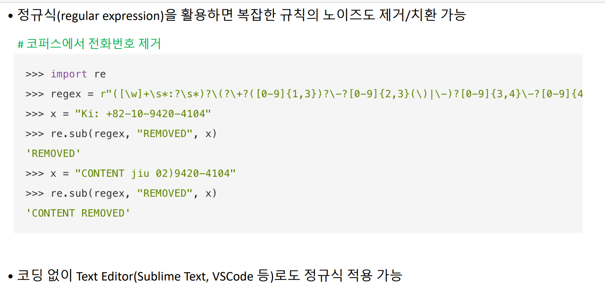
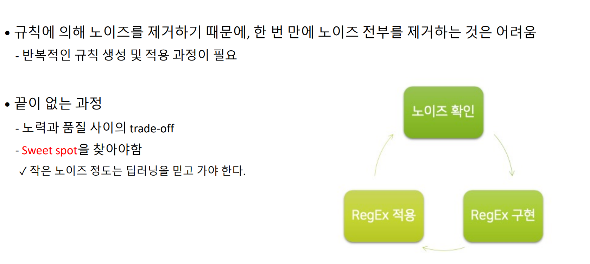
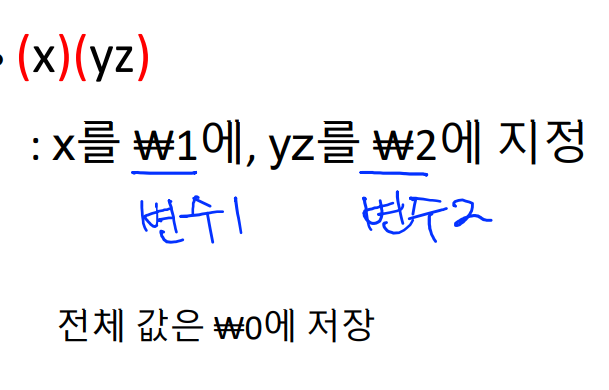
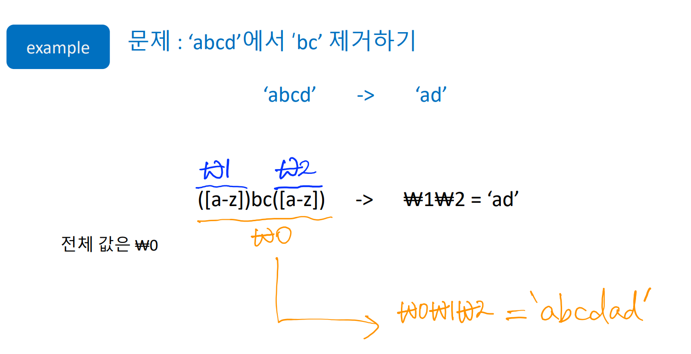
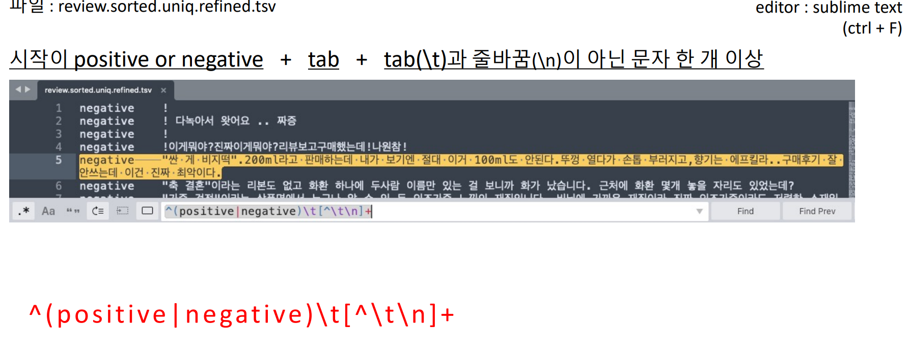

정규식 이용 노이즈 제거

전처리 중에서도 특히 텍스트 데이터 노이즈 제거의 경우, 

많은 노하우가 필요함. 

- 실무 경험상 알고리즘 담당과 별도로 전처리 담당자가 있는게 좋다

# 정규식

 Sublime Text 3이 편함

- "[ ]" : 하나의 character라도 매칭되는지 check

- ㅡ : 범위

- [^] : not character

- ^ : 문장의 시작, $ : 문장의 끝

- . : any character

  .{9} : 아무 캐릭터가 9번 출현 

  .+ : 아무 캐릭터가 한 번 이상 출현 

  b.+d : b와 d 사이에 아무 캐릭터가 한 번 이상 출현

- \ : 특수 문자가 아닌 문자(non-special character) 앞에서 사용된 백슬래시는 '해당 문자는 특별하고, 문자 그대로 해석되면 안된다'는 사실을 가리킴  단어 경계 문자를 형성

  ex)  -: 범위 but \- : 그저 대시의 의미(전화번호)

## 그룹화

- ( ) : 그룹화 및 변수로 지정

  

-  (x|y)  or
## 출현
-  x? : x가 0번 또는 1번 출현 
-  x+ : X가 **무조건 출현**. 한 번 이상 출현
- x* : x가 나타나지 않을수도, 반복될 수도 있음 - 강력한 표현. 유의해서 사용해야 함(잘안씀)

## 반복
- x{n} : n번 반복 
- x{n,}  : n번 이상 반복 
- x{n,m}  : n번 ~ m번까지 반복

## 메타 문자

# 정규식 코드

## 전용 모듈(refine.py) 활용 

전각문자-> 반각문자 여러 개의 공백-> 한 개의 공백 refine.py 모듈로 삭제

## 정규식 적용 실행문

예시

