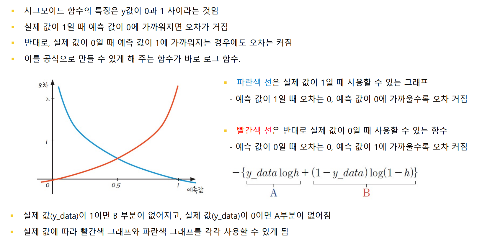

# 딥러닝 기초이론

딥러닝vs 머신러닝 vs 인공지능

- 머신러닝: 데이터를 이용해 앞 일을 예측하는 기법

-  인공지능의 큰 범주 안에 머신러닝이 속하고,  머신러닝 중 가장 좋은 효과를 내는 것이 딥러닝. 

​     -> 딥러닝을 배우려면 머신러닝의 기초 개념을 알아야 함

인공지능> 머신러닝 >딥러닝

데이터 

- 딥러닝은 데이터를 이용해 예측 또는 판별을 수행한다. 

-  지도학습(분류, 회귀) vs 비지도학습(GAN, 오토인코더) 

컴퓨터 

- CPU vs GPU 

- 대용량인 경우에는 GPU 작업환경을 갖추길 추천 프로그램 

- 딥러닝을 구동할 수 있게 프로그래밍

## 머신러닝 프로세스
머신러닝 : 데이터를 이용해 **미지의 일을 예측**하기 위해 만들어진 기법

학습(training) : 데이터가 입력되고 패턴이 분석되는 과정  

-  랜덤포레스트, 서포트 벡터 머신, 딥러닝 등 여러가지 머신러닝 기법들 존재

기존환자데이터입력 -> 머신러닝으로 학습 -> 새로운 환자 예측


# 딥러닝 프로세스

## 1. 퍼셉트론(Perceptron)이란

일단 **Perceptron**이라는 단어를 자세히 보면 퍼셉션과 뉴런, 이렇게 두 단어가 조합된 거라는 걸 알 수 있다.

- **Perception** : 무언가를 인지하는 능력
- **Neuron** : 감각 입력 정보를 의미있는 정보로 바꿔주는 뇌에 있는 신경 세포

결국 퍼셉트론은 생물학적 뉴런이 감각 정보를 받아서 문제를 해결하는 원리를 따라한 인공 뉴런이라고 볼 수 있다.

퍼셉트론을 하나만 보면 꽤 단순한 원리에 의해 결정을 내려준다.


**입력 값에 대해 가중치를 적용해 계산한 후, 확인해서 결과 전달하기.**

예를 들어 퍼셉트론 기반의 자율주행 자동차라고 하면, 왼쪽에 장애물이 있으면 오른쪽으로 핸들을 틀고 오른쪽에 장애물이 있으면 왼쪽으로 핸들을 트는 뭐 그런 셈. 장애물의 위치를 입력 받아서 어느 방향으로 핸들을 틀지 결정해주기만 하는 거다.

그런데 놀랍게도 **퍼셉트론은 자신이 내린 결과를 확인해서, 미래에는 더 나은 결정을 하도록 자기 자신을 수정한다!** 이게 딥러닝의 힘 아니겠는가.

물론 현실 세계는 이렇게 단순하지 않기 때문에 **수많은 퍼셉트론을 묶어놓은 일종의 다발, 신경망(neural network)**을 형성해서 문제를 해결해야 한다.

### 퍼셉트론의 구성요소

퍼셉트론은 세 가지 구성요소로 설명할 수 있다.

1. Inputs

인풋. 입력값. 뭐 흔히 머신러닝에서 말하는 feature(속성 혹은 자질)이다. 예를 들어 ‘사람’이라고 치면 키, 몸무게, 나이 같은 거.

2. Weights

가중치는 각 인풋에 대해 일정량의 중요도를 부여하는 개념이다. 예를 들어 어떤 인풋에 대해 가중치가 크다는 건 그 인풋이 아웃풋을 결정하는 데에 더 큰 역할을 한다는 뜻이다.

3. Output

퍼셉트론은 인풋과 가중치를 사용해서 아웃풋을 생성한다. 물론 아웃풋의 유형은 문제의 특성에 따라 조금씩 다르게 나타날 수 있다. 예를 들어 비가 올지 예측하려면 아웃풋이 2진(binary)일 거다. 1 아니면 0, 비가 오거나 안 오거나 둘 중 하나니까. 그런데 만약 다음 날의 온도를 예측하는 거라면 아웃풋의 범위가 커진다.

 퍼셉트론이 아웃풋을 내는 원리

퍼셉트론은 인풋을 받으면 가중치에 따라 가중합(**weighted sum**)을 계산하고, 그 값이 특정 기준을 만족하면(**activation function**) 1, 아니면 0 으로 결과를 돌려주는 방식이다.(sigmoid)

뇌에 있는 신경 세포, 뉴런 들이 어떻게 작동하는지 이런 이미지로 흔히 표현하는데


여기 이렇게 불이 들어오는 것처럼, 퍼셉트론도 그런 거다.

 퍼셉트론의 학습 방법

만약 인풋과 아웃풋을 모두 알고 있는 데이터가 있으면 이 퍼셉트론이 제대로 아웃풋을 냈는지 아닌지 확인할 수가 있다. 그래서 퍼셉트론은 결과를 제대로 못 맞출 때마다 학습 오류(**training error**)를 만들어내는 셈이다.

퍼셉트론의 성능을 개선하기 위해서는 이 퍼셉트론을 정의하는 파라미터, 즉 가중치를 변경해야 할 거다. 그리고 정답을 최대한 많이 맞출 수 있도록 **최적의 가중치 조합을 찾는 게 학습의 목표**가 된다.

출처: [퍼셉트론(Perceptron)과 신경망(Neural Networks) 쉽게 이해하기 - 아무튼 워라밸 (hleecaster.com)](https://hleecaster.com/ml-perceptron-concept/)


## 2. 딥러닝 구조

### 데이터셋


: 행은전체가져오기

열은 0:17/ 17만 가져오기

### 딥러닝 코드 구조


Dense layer (다층구도): 덴스함수

덴스 = 레이어

- 하나의 레이어에 node 30개
- 인풋레이어: input_dim
- 히든레이어: activation = 'relu'
- 아웃풋레이어: node =1activation = 'sigmoid' (0또는 1출력)


## 3. 딥러닝 실행


에폭:반복(for문)학습 batchsize:470개중에 10개씩 쪼개서 들어가짐

한번 에폭당 47개 배치가 돔

### `최적화과정`

loss는 예측이 실패할 확률, accuracy는 예측이 성공할 확률임

예측 성공률은 데이터를 분석해 데이터를 확장하거나, 딥러닝 구조를 적절하게 바꾸는 등의 노력으로 더 향상 가능 

 그뿐만 아니라 학습에 사용되지 않은 데이터를 따로 모아 테스트를 해 보면서 이 예측 성공률이 정말로 가능한지를 확인 하는 과정까지 거치게 됨 

- 이러한 ‘**최적화 과정**’을 진행하려면 딥러닝의 구동 원리를 이해해야 함***가장중요

## 4. 딥러닝 프로세스

> 입력값이 네트워크 층을 거치면 예측값이 나오고, 이를 실제값과 비교해서 Loss score를 계산한 후에 Optimizer를 통해 Weight를 업데이트 한다


### sequencial()함수

model.add( ) 함수안에는 Dense( ) 함수가 포함되어 있음 

- dense는 ‘조밀하게 모여있는 집합’이란 뜻으로, 

  각 층이 제각각 어떤 특성을 가질지 옵션을 설정하는 역할 

### compile()함수

- 딥러닝의 구조와 층별 옵션을 정하고 나면 compile( ) 함수를 이용해 이를 실행 

  - activation : 다음 층으로 어떻게 값을 넘길지 결정하는 부분 

  ​                           가장 많이 사용되는 함수 : relu() 함수, sigmoid() 함수

  

  - loss : 한 번 신경망이 실행될 때마다 오차 값을 추적하는 함수 

  - optimizer : 오차를 어떻게 줄여 나갈지 정하는 함수

     loss function: binary_crossentropy: 이진분류

     optimizer = 'adam' :오차 줄이는법 거의 **경사강법**

     metrics = 평가지표 "accuracy"

## 5. 오차함수(loss function)


위는 회귀/ 아래는 분류

선형회귀

로지스틱회귀

경사하강법으로 오차를 줄여나감

## 6. 활성화 함수(activation)
### 시그모이드 함수 (로지스틱함수)


```python
import numpy as np
import pandas as pd

# 공부시간 X와 성적 Y의 리스트를 만듭니다.
data = [[2, 0], [4, 0], [6, 0], [8, 1], [10, 1], [12, 1], [14, 1]]


x_data = [i[0] for i in data]
y_data = [i[1] for i in data]


# 기울기 a와 절편 b의 값을 초기화 합니다.
a = 0
b = 0

# 학습률을 정합니다.
lr = 0.05

# 시그모이드 함수를 정의합니다.
def sigmoid(x):
    return 1 / (1 + np.e ** (-x))

# 경사 하강법을 실행합니다.
for i in range(2001):
    for x_data, y_data in data:
        a_diff = x_data * (sigmoid(a*x_data + b) - y_data)
        b_diff = sigmoid(a*x_data + b) - y_data
        a = a - lr * a_diff
        b = b - lr * b_diff
        if i % 1000 == 0:    # 1000번 반복될 때마다 각 x_data값에 대한 현재의 a값, b값을 출력합니다.
            print("epoch=%.f, 기울기=%.04f, 절편=%.04f" % (i, a, b))

# 앞서 구한 기울기와 절편을 이용해 그래프를 그려 봅니다.
x_data = [i[0] for i in data]
y_data = [i[1] for i in data]


# UPDATE

# 책의 코드는 각각의 x에 대한 기울기, 절편의 변화가 epoch마다 모두 출력 되어 이를 확인하게 끔 되어 있습니다.
# 평균값을 구해 하나의 기울기와 절편을 출력하고, 1000 epoch마다 그래프를 그리면 다음과 같습니다.  

# 데이터 선언 
x = [i[0] for i in data]
y = [i[1] for i in data]
x_data = np.array(x)
y_data = np.array(y)

# 위에 계산된 a와 b의 값이 다시 사용되지 않기 위해 각각 0으로 초기화 합니다.
a = 0
b = 0

# 경사 하강법을 실행합니다.
for i in range(2001):
    a_diff = (1/len(x_data))*sum(x_data*(sigmoid(a*x_data + b) - y_data)) 
    b_diff = (1/len(x_data))*sum(sigmoid(a*x_data + b) - y_data)
    a = a - lr * a_diff
    b = b - lr * b_diff
    
    # 1000번 반복될 때마다 각 x_data값에 대한 현재의 a값, b값을 출력합니다.
    if i % 1000 == 0:    
        print("epoch=%.f, 기울기=%.04f, 절편=%.04f" % (i, a, b))
        plt.scatter(x_data, y_data)
        plt.xlim(0, 15)
        plt.ylim(-.1, 1.1)
        x_range = (np.arange(0, 15, 0.1)) #그래프로 나타낼 x값의 범위를 정합니다.
        plt.plot(np.arange(0, 15, 0.1), np.array([sigmoid(a*x + b) for x in x_range]))
        plt.show()

-> epoch이 진행될수록 sigmoid 모델의 a, b 파라미터가 업데이트되어 최적의 모델로 업데이트 되고 있다.


```

### 그외


**softmax: 아이리스붓꽃경우(다중분류)/손글씨(엠니스트)-분류 회귀X

# XOR문제


`차원의변화`

## 해결: 다층퍼셉트론


선형문제가아닌 비선형문제(공간왜곡->층을쌓음=>Xbox우리가 모름)


w와 b를 오차함수를 줄이는방향(경사하강법)으로 업데이트 / epochs숫자만큼 반복


시그마=시그모이드 활성화함수

Y(out) = 0 or 1

- XOR문제 해결


## 해결: 오차역전파(backpropagation)
>경사강법의 확장된 개념 =>학습율도 등장(learning rate)

- **임의의 가중치**를 선언하고 결괏값을 이용해 오차를 구한 뒤 

​		오차가 최소인 지점으로 계속해서 조금씩 이동(update)시킴(최적화)

- 오차가 최소가 되는 점(미분했을 때 기울기가 0이 되는 지점)을 찾으면 그것이 바로 정답


- 가중치 수정(epochs)반복: 모델링 

# 기울기 소실 (vanishing gradient)

> 시그모이드함수 문제점 =>렐루/탄젠트

- 다층 퍼셉트론이 오차 역전파를 만나 신경망이 되었고, 신경망은 XOR문제를 가볍게 해결함 

-  이제 신경망을 차곡차곡 쌓아올리면 마치 사람처럼 생각하고 판단하는 인공지능이 금방이라도 완성될 것처럼 보였지만 실제로는 결과가 좋지 않음. 그 원인은 기울기 소실(vanishing gradient) 문제

- 가중치를 수정하려면 미분 값, 즉 기울기가 필요하다고 배웠는데, 층이 늘어나면서 기울기 값이 점점 작아져 맨 처음 층까지 전달되지 않는 기울기 소실 문제 발 - **0 에 수렴함**


## 시그모이드 외 활성화함수 도입


§ 하이퍼볼릭 탄젠트(tanh) 함수 

• 미분한 값의 범위가 함께 확장되는 효과를 가져옴 

• 다양한 여전히 1보다 작은 값이 존재하므로 기울기 소실 문제는 사라지지 않음 

§ 렐루(ReLU) 함수 

• 시그모이드 함수의 대안으로 떠오르며 현재 가장 많이 사용되는 활성화 함수 

• 여러 은닉층을 거치며 곱해지더라도 맨 처음 층까지 사라지지 않고 남아있을 수 있음 

• 이 간단한 방법이 여러 층을 쌓을 수 있게 했고, 이로써 딥러닝의 발전에 속도가 붙게 됨 

§ 소프트플러스 (softplus) 함수 

• 이후 렐루의 0이 되는 순간을 완화


# 확률적 경사하강법(SGD)

> 가중치를 업데이트하는 방법으로 우리는 경사 하강qjqtkdyd
>
> - 경사 하강법은 정확하게 가중치를 찾아가지만,  한 번 업데이트할 때마다 **전체 데이터를 미분**해야 하므로 **계산량이 매우 많다**는 단점이 있음 
>
> -  속도를 느리게 할 뿐 아니라, 최적 해를 찾기 전 최적화 과정이 멈출 수도 있음 
>
>확률적 경사 하강법(Stochastic Gradient Descent, SGD) 
> -   랜덤하게 추출한 일부 데이터를 사용 -> 더 빨리 그리고 자주 업데이트를 하는 것이 가능해짐


### 아담

> 최근 가장 많이 사용되는 고급경사하강법


# 다중분류문제 해결(아이리스)

## 원핫인코딩


### tf.keras.utils.to_categorical() vs pd.get_dummies

getdummies같은역할: 데이터프레임


## 활성화함수 소프트맥스

> 자동으로 원핫인코딩


softmax:확률값으로 나옴=>max를 답으로채택


-> loss 함수: categorical_crossentropy


# 과적합(sonar-음파데이터)

 train 데이터로 학습, test 데이터로 평가


## 얼리스타핑


식이 복잡해지고 학습량이 늘어날수록 학습 데이터를 통한 예측률은 계속해서 올라가지만, 검증 셋을 이용한 예측률은 어느 순간부터는 떨 어지는 것을 확인할 수 있음(그 순간이 과적합의 순간이므로 학습을 멈춰!야 함)


은닉층이 증가할수록 

- 학습셋 예측률은 증가하다가 결국 은닉층 24개 에 이르면 100%를 보임
- 검증셋 예측률은 은닉층 12개에서 90.4%로 최고를 이루다 24개째에서는 다시 89.2%로 떨어짐(은닉층 12개 이상은 과적합 가능성 존재

## 학습셋 데이터 셋 나누기(sklearn라이브러리)

 ```python
 from keras.models import Sequential
 from keras.layers.core import Dense
 from sklearn.preprocessing import LabelEncoder
 from sklearn.model_selection import train_test_split
 
 import pandas as pd
 import numpy as np
 import tensorflow as tf
 
 # seed 값 설정
 seed = 0
 numpy.random.seed(seed)
 tf.random.set_seed(3)
 ```


