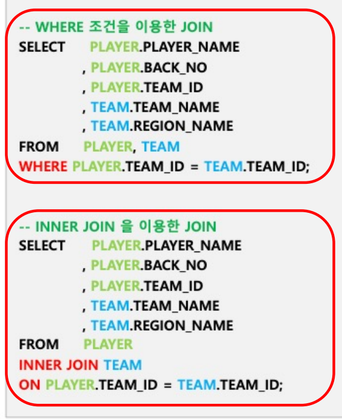
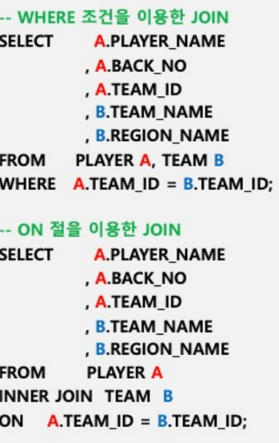
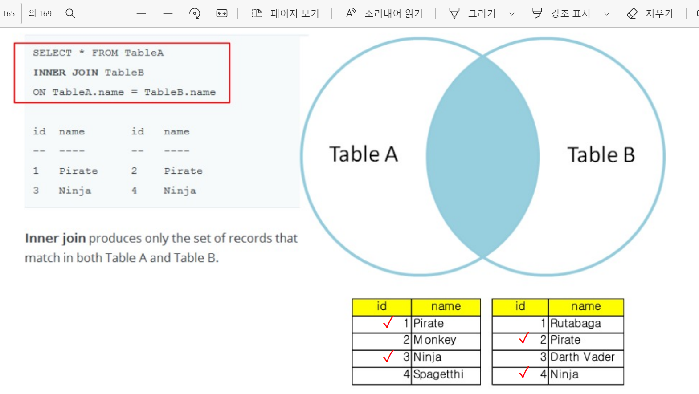
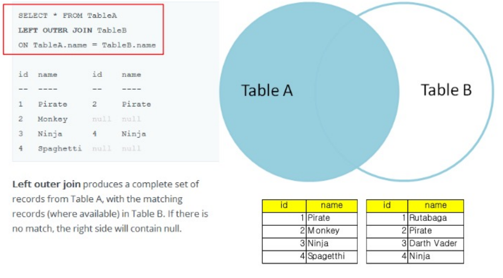
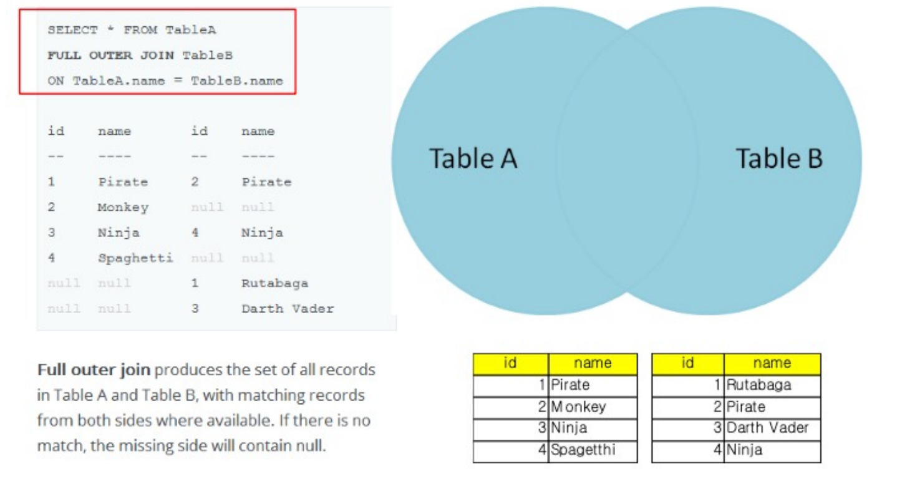
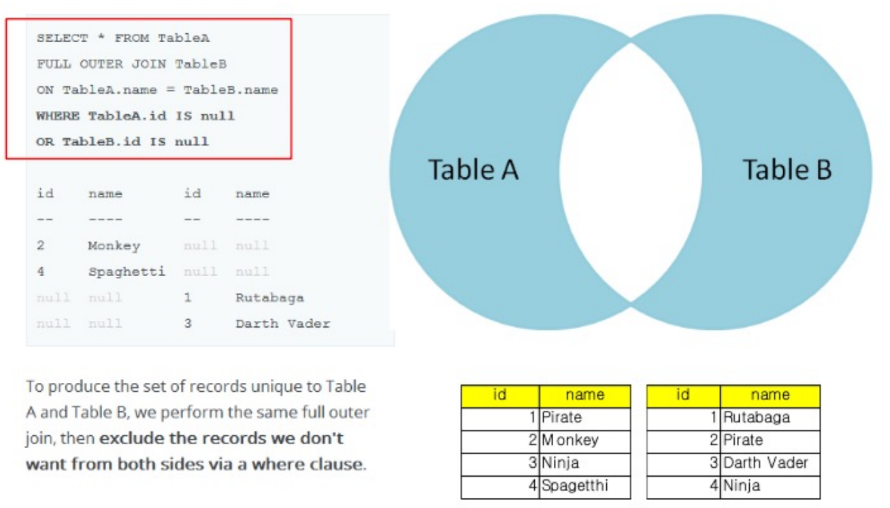

#  데이터베이스

\- 1970년 관계형 모델이 제안되면서 현재의 MySQL, Oracle 등 Relational Database(RDBMS)가 보편적

-최근 Bigdata 시대와 더불어 대용량 데이터를 분산 저장 및 조회할 수 있는 NoSQL 데이터베이스가 등장

- NoSQL 데이터베이스의 높은 성능에 부합하면서 관계형/SQL 모델을 보유하는 NewSQL 구현 시도

## 스키마(RDBMS)

# SQL(Structured Query Language)

● 표준 관계형 데이터베이스 언어

​    데이터베이스에서 데이터를 다루기 위한 표준 언어

● SQL의 유형

## DDL/DML

● 데이터베이스 **정의**어(DDL, Data Definition Language) 

- 스키마, 도메인, 테이블, 뷰, 인덱스를 **정의하거나 변경 또는 제거**할 때 사용하는 언어

  

● 데이터베이스 **조작**어(DML, Data Manipulation Language)

- 응용 프로그램이나 **질의어**를 통해 저장된 데이터를 관리 및 조작하는 언어 
- DML의 주요 커맨드 유형인 SELECT, INSERT, UPDATE, DELETE 중에서도, 데이터분석가/마케터 등 데이터 조회 및 분석 업무를 하는 사용자는 **SELECT문**을 주로 사용함

## Index

인덱스 : 데이터를 찾아갈 수 있도록 추가적으로 생성한 데이터 

● 인덱스는 일반 테이블이나 클러스터에서 쓰여지는 선택적인 객체로서, 데이터베이스 테이블 내의 원하는 레코드를 **빠르게 찾아갈 수 있도록** 만들어진 데이터 구조를 말함. 

● 인덱스 4가지 유형 

1. Primary Key(PK, 기본키) - 중복되지 않은 유일키 
2. Normal - 중복을 허용하는 인덱스 
3. Unique - 중복을 허용하지 않는 유일키 (이메일)
4. Foreign Key(FK, 외래키) - 다른 테이블과 관계성을 부여하는 키

● Primary Key는 Not null + Unique 개념, 즉 고유한 ID를 말함(그림1) 

● Secondary Key는 Unique할 필요가 없으며, 데이터를 빠르게 찾기 위해 지정함 

● Foreign Key는 하나 이상의 테이블을 서로 연결하여 사용하는 관계형 데이터베이스에서 하나의 테이블 속성 또는 속성 집합이 다른 테이블의 기본키가 되는 것을 의미(그림2

## ERD(Entity Relationship Diagram) 

엔터티(테이블) 간 관계를 그린 다이어그램

# 쿼리실행

## 스키마 실행

## 데이터베이스 확인

### show databases;

### 조건 like

# select

- 공백/ 줄바꾸기도 사용가능(무시됨)

● SELECT USER_NAME, GENDER FROM USER_INFO;

● SELECT * FROM USER_INFO;(전부)

## 정리

export / import가능

# 정렬(orderby)

# 중복제거(distinct, count)

## distinct

## All

## count:로우갯수

## distinct + count

# 별칭

# 조건절(where, limit)

## 조건절 연산자

## and &&

## limit

## isnull isnotnull

 MySQL에서 NULL은 가장 작은 값으로 정렬 됨(데이터베이스마다 다름)

-  아래 데이터에서 name이 South Korea가 아닌 나라의 수를 세려면?

## if null

# join

두 개 이상의 테이블을 연결하여 데이터를 출력하는 것을 JOIN이라고 함 

- RDBMS(관계형 데이터베이스)의 가장 큰 장점 

- FROM 절에 여러 개의 테이블이 나열되더라도, 실제 처리 시 두 개의 테이블만 조인 됨 예를 들어 A, B, C, D 4개의 테이블을 조인하고자 할 경우 쿼리 옵티마이저는 ( ( (A JOIN D) JOIN C ) JOIN B )와 같이 순차적으로 조인을 처리하게 됨

JOIN의 방법과 방식
- 조인 방법 : Equi Join(등가조인, 내부조인), Non-Equi Join, Self Join, Outer Join 
- 조인 방식 : Nested Loop Join, Sort Merge Join, Hash Join

## 내부조인 

방법 2가지 : WHERE 조건 이용, INNER JOIN, ON 이용 테이블 간 교집합을 구하는 방

## 조인유형

● (INNER) JOIN - Returns records that have matching values in both tables  

JOIN 구문의 조건이 A 와 B 테이블 양쪽 테이블에 일치하는 결과, 쉽게 말해 교집합을 구함

● LEFT (OUTER) JOIN - Return all records from the left table, and the matched records from the right table

왼쪽 테이블을 기준으로 오른쪽 테이블의 JOIN 조건에 일치하는 데이터를 출력

  

● RIGHT (OUTER) JOIN - Return all records from the right table, and the matched records from the left table  ● FULL (OUTER) JOIN - Return all records when there is a match in either left or right table

테이블 A 와 B 의 합집합을 구하는 JOIN 

조건절을 활용하여 각각의 테이블에만 존재하는 데이터를 조회할 수 있음

