# select

- 공백/ 줄바꾸기도 사용가능(무시됨)

● SELECT USER_NAME, GENDER FROM USER_INFO;

● SELECT * FROM USER_INFO;(전부)

## 정리

export / import가능

# 정렬(orderby)

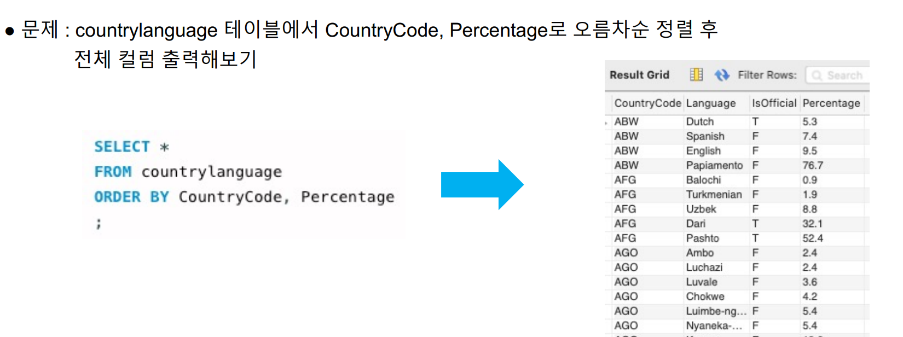

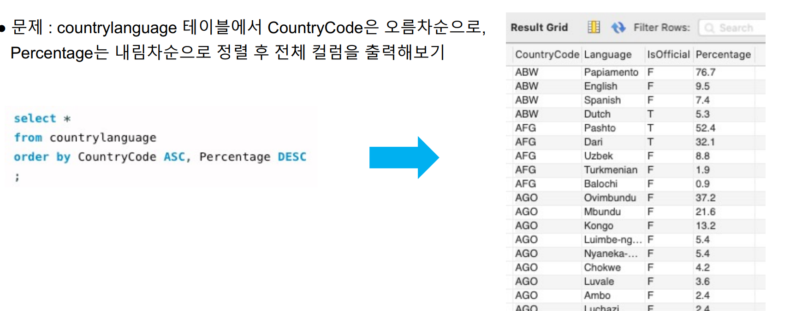

# 중복제거(distinct, count)

## distinct

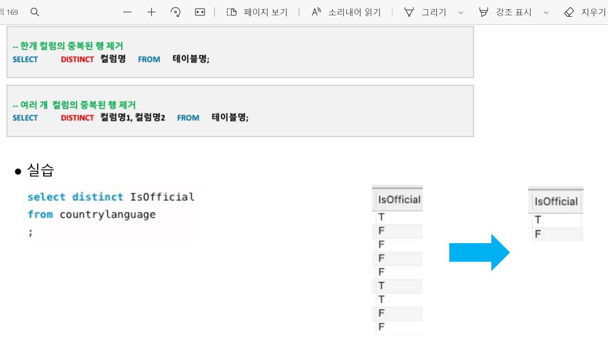

## All

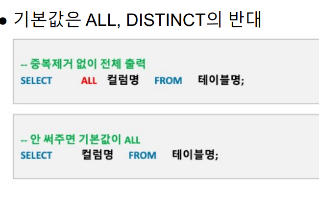

## count:로우갯수

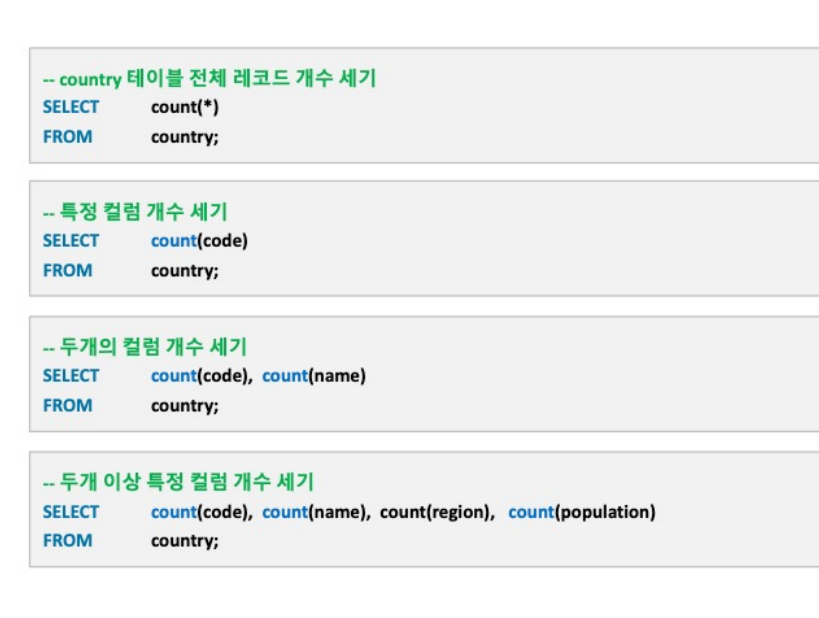

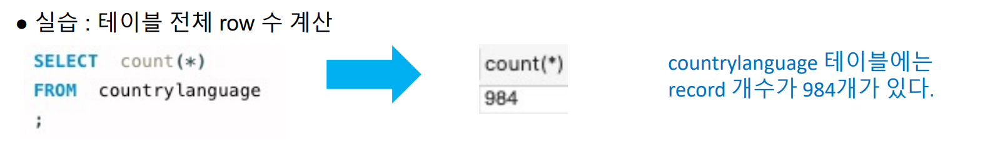

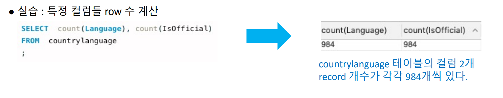

## distinct + count

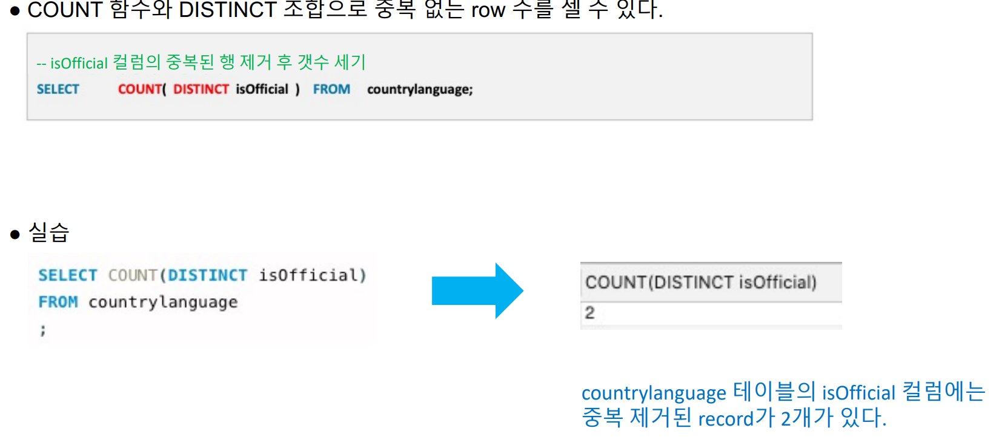

# 별칭

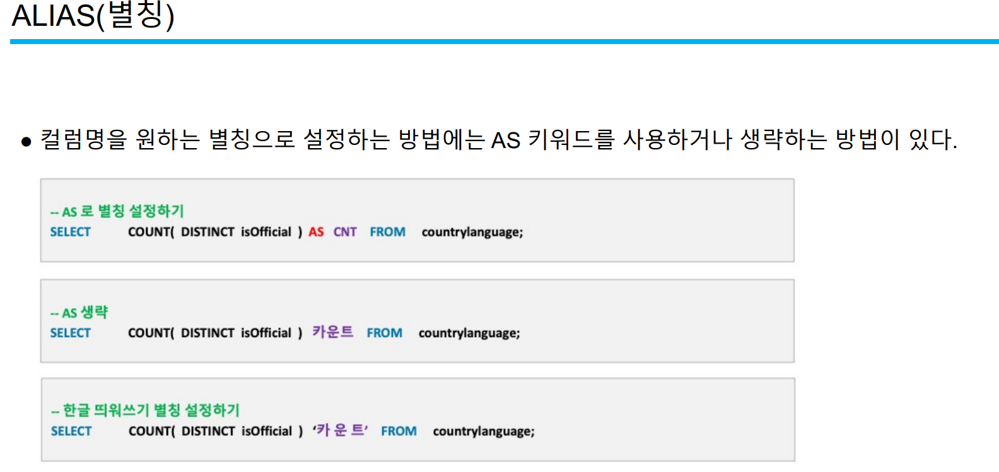

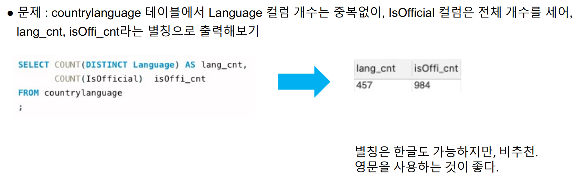

# 조건절(where, limit)

## 조건절 연산자

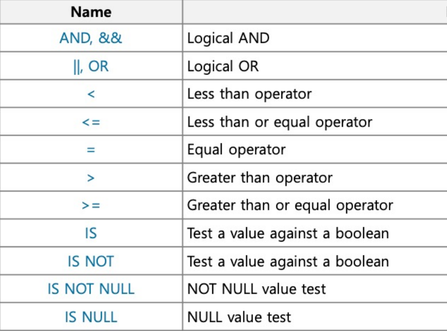

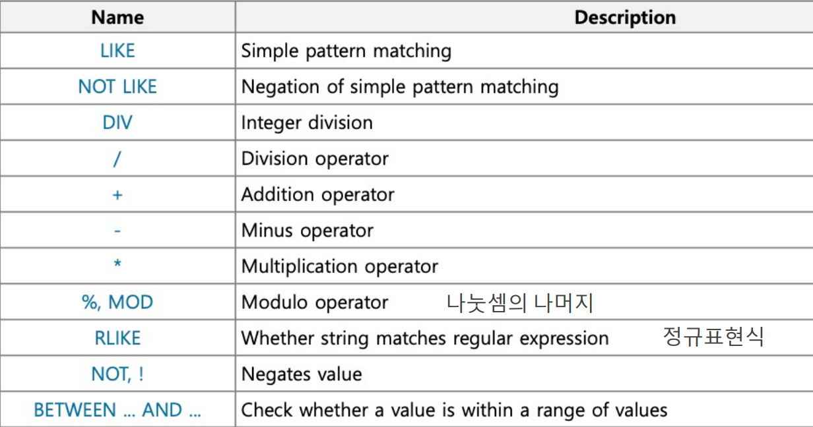

## and &&

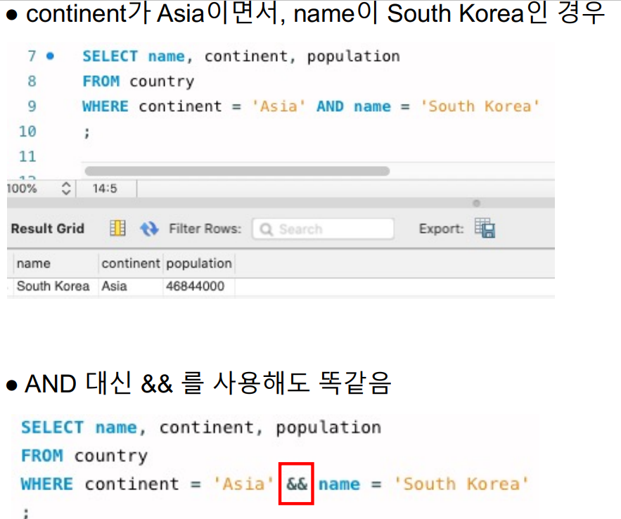

## limit

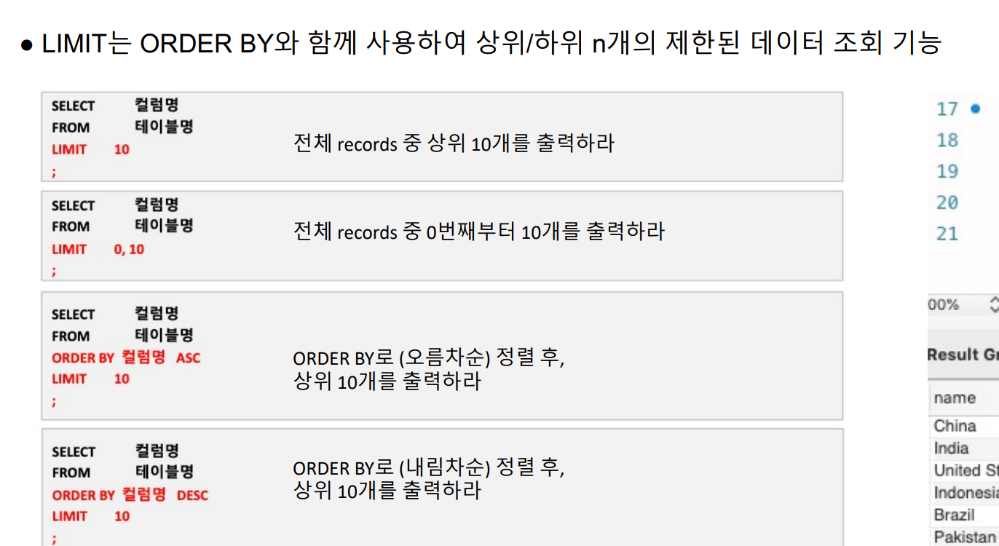

## isnull isnotnull

 MySQL에서 NULL은 가장 작은 값으로 정렬 됨(데이터베이스마다 다름)

-  아래 데이터에서 name이 South Korea가 아닌 나라의 수를 세려면?

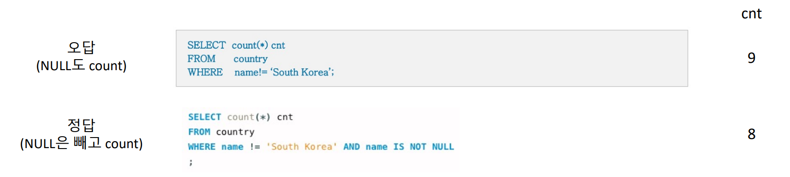

## if null

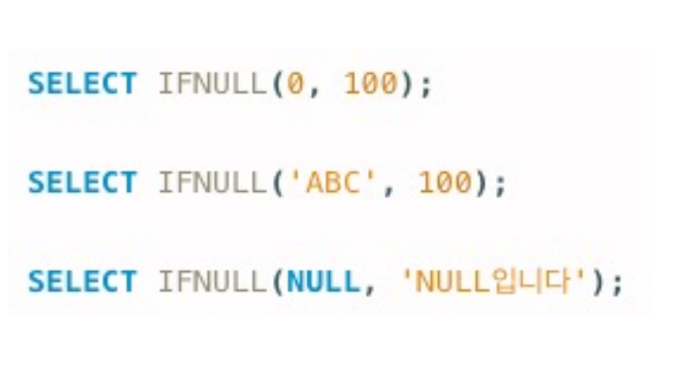
